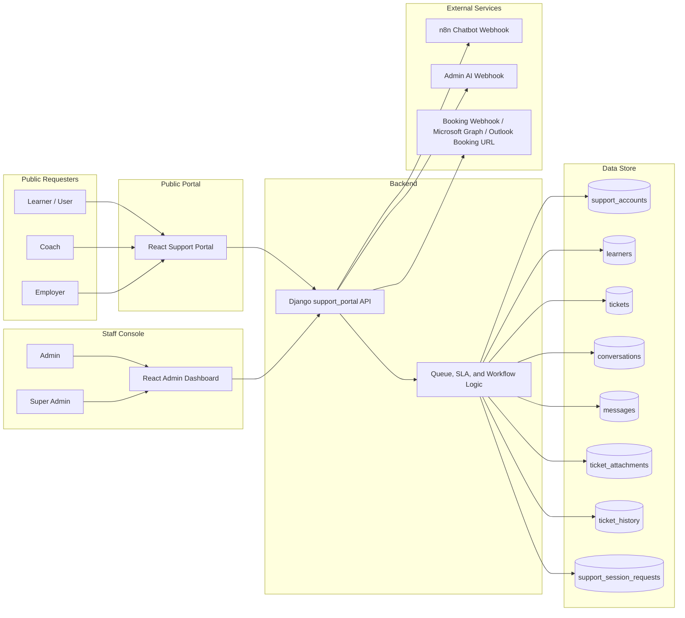

# Support Portal Features and Workflows

## 1. Product Summary

This repository implements a support portal with:

- A React + Vite frontend in `frontend/`
- A Django API/backend in `backend/`
- A PostgreSQL support data model for requester accounts, learner profiles, tickets, chat, attachments, history, and support session requests

At a high level, the system supports:

- Public requester verification by email
- Ticket creation and update
- Chatbot-assisted support
- Live chat escalation
- Support session booking and cancellation
- Admin dashboard and live-chat console
- Requester/admin account management
- SLA tracking, queue assignment, and ticket audit history

## 2. Role Model

The current codebase uses the following role model:

| Business Role | Technical Role | Account Scope | Current Behavior |
| --- | --- | --- | --- |
| Learner | `user` | `requester` | Standard public support flow |
| Coach | `coach` | `requester` | Quick-ticket-only flow |
| Employer | `employer` | `requester` | Standard public flow with elevated priority |
| Admin | `admin` | `staff` | Dashboard, queue, chat console, account management |
| Super Admin | `superadmin` | `staff` | Everything an admin can do, plus manual assignment of unassigned tickets |
| Agent | `agent` | `staff` | Modeled in the backend and queue logic, but not currently admitted by the browser login gate |

## 3. Current Feature Inventory

### Public requester features

- Email verification against active requester accounts in `support_accounts`
- Automatic requester-role detection from the verified account
- Restore/resume of an existing active request
- Ticket creation and editing
- Evidence selection with local preview
- Chatbot conversation with saved message history
- Live-chat request from chat
- Support session request from chat
- Support session cancellation from the status page
- Status page with meeting state, quick-ticket state, and chat resume behavior
- Chat transcript PDF export
- Inactivity reminder and auto-close handling in chat

### Staff features

- Admin login
- Session heartbeat and console presence (`Available`, `Off`, derived `Busy`)
- Ticket dashboard with ticket detail drawer
- Live-chat console for active conversations
- Internal notes and structured documentation capture
- Ticket status updates and closing
- Transfer requests between staff
- Escalation notification workflow
- Follow-up ticket creation from an existing conversation
- AI assistant panel backed by webhook integration
- Requester account management
- Admin account management
- Automatic quick-ticket assignment to admins
- Automatic live-chat queue assignment to active staff sessions

### Superadmin-specific features

- Manual assignment of unassigned tickets to admin accounts from the dashboard

## 4. Role Workflows

### Learners (`user`)    

1. Enter a registered email address on `/`.
2. The backend verifies that the email belongs to an active requester account with role `user`.
3. If an active ticket already exists, the learner can resume it.
4. Otherwise, the learner creates or updates the inquiry.
5. The learner chooses how to continue:
   - continue to chatbot/live chat/meeting flow
   - or submit a quick ticket directly
6. In chat, the learner can:
   - talk to the chatbot
   - request a live agent
   - request a support session
7. The learner can review status, reopen the chat when allowed, cancel an active meeting, or download the transcript.

### Coaches (`coach`)

1. Enter a registered email address on `/`.
2. The backend identifies the requester as a coach account.
3. The coach creates or updates the inquiry.
4. The frontend immediately routes the coach into a quick-ticket submission path.
5. The ticket is marked `Pending` with status reason `Quick Ticket`.
6. The backend attempts automatic assignment to an available admin.
7. The coach sees the status page rather than chatbot/live chat/booking steps.

Coach-specific rule:

- Coaches cannot use chatbot, live chat, or meeting-booking endpoints in the current implementation.

### Employers (`employer`)

1. Enter a registered email address on `/`.
2. The backend identifies the requester as an employer account.
3. The employer creates or updates the inquiry.
4. The employer can choose between:
   - chatbot/live support flow
   - direct quick-ticket submission
5. If chat is used, the employer can request a live agent or a support session.
6. The ticket stays visible on the status page for follow-up.

Employer-specific rule:

- Employer tickets are elevated to `High` priority when created or updated.

### Admins / Agents

Operationally, the backend groups `admin`, `superadmin`, and `agent` under `staff`, but the current web sign-in path only allows `admin` and `superadmin`.

Admin workflow:

1. Sign in at `/admin/login`.
2. The backend registers a console session and marks presence.
3. The dashboard loads ticket lists, active queue state, and account directories.
4. Admins can:
   - review ticket details
   - inspect attachments, history, and support session requests
   - respond in live chat when the learner requested human support
   - save internal notes and structured documentation
   - close tickets
   - request transfer to another admin
   - escalate a case to another admin
   - create a follow-up ticket tied to the same conversation
   - use the admin AI panel
   - manage requester and admin accounts

Agent note:

- The `agent` role exists in the schema and queue logic, but the browser route guard and login response currently admit only `admin` and `superadmin`.

### Super Admins

Superadmins follow the same dashboard flow as admins, with one extra privilege:

1. Open an unassigned ticket in the dashboard.
2. Manually assign it to an admin account.
3. Continue using the same note, escalation, transfer, and closure tools available to admins.

## 5. Ticket and Conversation Lifecycle

### Ticket states

- `Open`
- `Pending`
- `Closed`

### Key status reasons in active use

- `Quick Ticket`
- `Awaiting support meeting`
- `Escalation`
- `Closed via Chatbot`
- `Closed via Agent`
- `Closed due to inactivity`

### Typical lifecycle paths

Standard learner or employer:

1. Verified
2. Ticket created
3. `Open`
4. Chatbot conversation
5. Optional live chat request or support session request
6. `Pending` while meeting or escalation is active
7. `Closed` when resolved

Coach:

1. Verified
2. Ticket created
3. Quick-ticket submission
4. `Pending` with `Quick Ticket`
5. Admin review and resolution

## 6. Admin Operations Model

### Queue behavior

- Live chat is assigned across active staff sessions
- Queue order prefers available staff before busy staff
- Queue fairness considers prior assignment timestamps and queue-join time
- Quick tickets are auto-assigned to active admin accounts

### Documentation and follow-up behavior

Admins can attach structured documentation to a ticket, including:

- inquiry summary
- ticket/chat identifiers
- target workflow status
- escalation target and note

If a case needs continued work on the same conversation, the system can create a follow-up ticket while preserving the conversation chain.

## 7. Data Model Summary

The current support schema centers on these tables:

- `support_accounts`
  - unified account directory for requester and staff identities
- `learners`
  - learner/profile record linked to requester accounts when applicable
- `tickets`
  - support case record with status, priority, assignment, SLA, and metadata
- `conversations`
  - chat channel state for the support flow
- `messages`
  - persisted chat messages for chatbot and live-chat history
- `ticket_attachments`
  - stored attachment metadata
- `ticket_history`
  - audit/event log for ticket lifecycle changes
- `support_session_requests`
  - meeting request and booking records

## 8. Integration Points

The backend can integrate with:

- `N8N_CHATBOT_WEBHOOK_URL`
  - learner chatbot replies
- `N8N_ADMIN_AI_WEBHOOK_URL`
  - admin AI assistant panel
- `N8N_BOOKING_WEBHOOK_URL`
  - support session booking workflow
- Microsoft Graph Bookings configuration
  - direct booking mode when configured
- `SUPPORT_BOOKING_URL`
  - official external booking page fallback

## 9. Current Implementation Notes

These notes are important for anyone documenting or extending the system:

- Public verification is driven by active requester accounts in `support_accounts`, not by a raw learner-only lookup.
- The current public inquiry form submits `Technical` tickets only, even though the backend contract supports `Learning`, `Technical`, and `Others`.
- Coaches are intentionally blocked from chatbot, live-chat, and meeting-booking endpoints.
- The code models an `agent` staff role, but the current browser login and route guard are `admin`/`superadmin` based.
- Attachment handling currently persists attachment metadata rather than a file-storage URL or binary upload workflow.

## 10. Routes and Major Endpoints

### Frontend routes

- `/`
- `/support/inquiry`
- `/support/options`
- `/support/chat`
- `/support/booking`
- `/support/booking-confirmed`
- `/support/status`
- `/admin/login`
- `/admin`

### Major API endpoints

- `POST /api/verify-email`
- `POST /api/tickets`
- `PATCH /api/tickets/:publicId`
- `GET /api/tickets/:publicId/chat-context`
- `GET /api/tickets/:publicId/chat-history`
- `POST /api/tickets/:publicId/chat-history`
- `POST /api/tickets/:publicId/chatbot-message`
- `POST /api/tickets/:publicId/live-chat-request`
- `POST /api/tickets/:publicId/session-requests`
- `POST /api/tickets/:publicId/session-requests/cancel`
- `POST /api/admin/login`
- `POST /api/admin/session-heartbeat`
- `POST /api/admin/logout`
- `GET /api/admin/tickets`
- `GET /api/admin/tickets/:publicId`
- `PATCH /api/admin/tickets/:publicId`
- `POST /api/admin/tickets/:publicId/transfer-request`
- `POST /api/admin/tickets/:publicId/transfer-request/accept`
- `POST /api/admin/tickets/:publicId/transfer-request/reject`
- `POST /api/admin/tickets/:publicId/follow-up-ticket`
- `POST /api/admin/tickets/:publicId/ai-agent-message`
- `GET /api/admin/accounts`
- `POST /api/admin/accounts`
- `PATCH /api/admin/accounts/:accountId`

## 11. System Design Diagram

